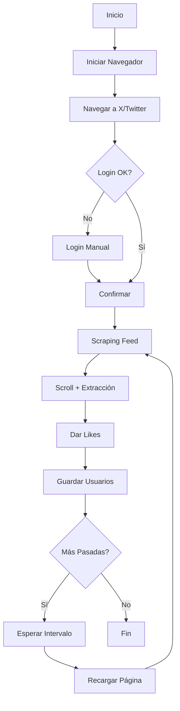

# 🤖 Twitter Bot Scraping

<div align="center">
<a href="https://wa.me/+573001234567?text=Hola%20desde%20BotCryptoV2%20🚀" target="_blank" rel="noopener noreferrer"></a>
<a href="https://twitter.com/AndresDvst25" target="_blank" rel="noopener noreferrer"></a>
<a href="https://www.facebook.com/andres.campos.732122" target="_blank" rel="noopener noreferrer"></a>
<a href="https://www.instagram.com/andres.devback/" target="_blank" rel="noopener noreferrer"></a>
<a href="https://www.linkedin.com/in/andresdevback22/" target="_blank" rel="noopener noreferrer"></a>
<a href="https://github.com/AndresDvst" target="_blank" rel="noopener noreferrer"></a>
<a href="https://discord.com/users/1133809866130067476" target="_blank" rel="noopener noreferrer"></a>
</div>

<br>

<div align="center">

**Bot profesional en Python para automatización inteligente de X/Twitter**

_Scraping seguro • Gestión de usuarios • Anti-detección avanzada_

[](https://www.python.org/downloads/)
[](https://www.selenium.dev/)
[](LICENSE)

</div>

---

## 📋 Tabla de Contenidos

- [✨ Características](#-características)
- [🚀 Instalación Rápida](#-instalación-rápida)
- [⚙️ Configuración](#️-configuración)
- [💻 Uso](#-uso)
- [🏗️ Arquitectura](#️-arquitectura)
- [🛡️ Anti-Detección](#️-anti-detección)
- [📊 Estructura de Datos](#-estructura-de-datos)
- [🔧 Características Técnicas](#-características-técnicas)
- [📝 Buenas Prácticas](#-buenas-prácticas)
- [🤝 Contribuir](#-contribuir)

---

## ✨ Características

### 🎯 Funcionalidades Principales

- **🔄 Scraping Inteligente**: Extracción automática de usuarios con likes estratégicos
- **💙 Likes Automatizados**: Sistema inteligente que evita detección con saltos aleatorios (2-6 tweets)
- **👥 Gestión de Usuarios**: Base de datos completa con historial y detección de duplicados
- **🕐 Modo Automático**: Ejecución programada cada 10 minutos durante 1 hora
- **📊 Estadísticas Detalladas**: Métricas en tiempo real de usuarios y actividad
- **🔐 Sesión Persistente**: Perfil de Chrome dedicado para mantener login

### 🛡️ Sistema de Protección Profesional

- **🎭 Anti-Detección Avanzada**
  - User-Agent aleatorio en cada sesión
  - Pausas con distribución normal (comportamiento humano)
  - Scrolls con distancia variable
  - Modificación de `navigator.webdriver`
- **⚡ Rate Limiting Automático**
  - Monitoreo de likes por hora
  - Pausa automática al alcanzar límites
  - Configurable según necesidades

- **💾 Sistema de Backups**
  - Backup automático antes de modificar datos
  - Rotación de backups (mantiene últimos 10)
  - Restauración fácil en caso de error

- **🔄 Checkpoints**
  - Guardado automático de estado
  - Recuperación ante interrupciones
  - Reanudación desde último punto

- **📝 Logging Profesional**
  - Logs con colores en consola
  - Rotación automática de archivos
  - Niveles: DEBUG, INFO, WARNING, ERROR

- **📋 Historial por Keywords**
  - Registro de asignaciones por keyword (aurora/emily/eva/gaby)
  - Validación de 3 días: no repite usuarios en el mismo keyword
  - Permite reutilizar usuarios en diferentes keywords
  - Trazabilidad completa de todas las asignaciones

---

## 🚀 Instalación Rápida

### 1️⃣ Clonar Repositorio

```bash
git clone https://github.com/AndresDvst/Twitter-Bot-Scraping.git
cd Twitter-Bot-Scraping
```

### 2️⃣ Crear Entorno Virtual

```bash
python -m venv venv
venv\Scripts\activate  # Windows
# source venv/bin/activate  # Linux/Mac
```

### 3️⃣ Instalar Dependencias

```bash
pip install -r requirements.txt
```

### 4️⃣ Verificar Instalación

```bash
python verificar_instalacion.py
```

---

## ⚙️ Configuración

### Configuración Básica (Opcional)

Copia el archivo de ejemplo y personaliza según tus necesidades:

```bash
copy .env.example .env
notepad .env  # Editar configuración
```

### Variables de Entorno Principales

```env
# Scraping
USUARIOS_POR_PASADA=10
LIKES_POR_PASADA=10
INTERVALO_MINUTOS=10

# Seguridad
MAX_LIKES_PER_HOUR=50
MAX_LIKES_PER_DAY=200

# Logging
LOG_LEVEL=INFO

# Anti-Detección
MIN_PAUSE_SECONDS=2.0
MAX_PAUSE_SECONDS=5.0
MIN_POST_LIKE_WAIT=5.0
MAX_POST_LIKE_WAIT=8.0
```

> **Nota**: Si no creas `.env`, el bot usará valores por defecto sensatos.

---

## 💻 Uso

### Ejecutar el Bot

```bash
python bot.py
```

### Menú Principal

```
==================================================
BOT DE GESTIÓN DE USUARIOS DE TWITTER
==================================================

1. Modificar JSON de login (usuarios aleatorios)
2. Iniciar scraping automático (1 hora, cada 10 min)
3. Scraping manual (una sola pasada)
4. Ver estadísticas
5. Limpiar historial antiguo (>30 días)
6. Salir
==================================================
```

### 🎯 Opciones Detalladas

#### Opción 1: Modificar Login JSON ⭐ Mejorado

Genera `login.json` con 40 usuarios aleatorios distribuidos en 4 grupos (aurora/emily/eva/gaby).

**Características:**

- ✅ **Validación por keyword**: No repite usuarios en el mismo keyword por 3 días
- ✅ **Historial inteligente**: Registra cada asignación con keyword y fecha
- ✅ **Flexibilidad**: Permite el mismo usuario en diferentes keywords
- ✅ **Backup automático**: Crea respaldo antes de modificar
- ✅ **Resumen detallado**: Muestra cuántos usuarios se asignaron a cada keyword

**Ejemplo de uso:**

```
Selecciona una opción: 1

INFO | ⚠ 5 usuarios filtrados por uso reciente en keywords
INFO | ✓ login.json actualizado en: I:\Archivos\login.json
INFO | 📊 Resumen de asignación:
INFO |   - aurora: 10 usuarios
INFO |   - emily: 10 usuarios
INFO |   - eva: 10 usuarios
INFO |   - gaby: 10 usuarios
INFO |   - Total: 40 usuarios asignados
```

#### Opción 2: Scraping Automático ⭐ Recomendado

- Duración: 1 hora
- Intervalo: cada 10 minutos
- Total: 6 pasadas
- Likes por pasada: 10
- **Recarga automática de página** entre pasadas

#### Opción 3: Scraping Manual

Una sola pasada para pruebas rápidas.

#### Opción 4: Estadísticas

Muestra métricas del sistema:

- Total usuarios en base principal
- Usuarios en historial
- Usuarios repetidos detectados

#### Opción 5: Limpiar Historial

Elimina registros antiguos (>30 días) para mantener la base limpia.

---

## 🏗️ Arquitectura

### Estructura del Proyecto

```
Twitter-Bot-Scraping/
├── 📄 Archivos Principales
│   ├── bot.py                    # Punto de entrada (CLI)
│   ├── scraper.py                # Lógica de scraping
│   ├── manager.py                # Gestión de usuarios
│   ├── config.py                 # Configuración centralizada
│   ├── logger.py                 # Sistema de logging
│   ├── utils.py                  # Utilidades y errores
│   ├── backup.py                 # Sistema de backups
│   ├── checkpoint.py             # Sistema de checkpoints
│   └── verificar_instalacion.py # Script de verificación
│
├── ⚙️ Configuración
│   ├── .env.example              # Plantilla de configuración
│   ├── .env                      # Tu configuración (no versionar)
│   ├── requirements.txt          # Dependencias Python
│   └── .gitignore                # Archivos ignorados
│
├── 📂 Datos (generados automáticamente)
│   ├── data/
│   │   ├── usuarios_principales.json
│   │   ├── usuarios_base.json
│   │   ├── historial_entregados.json
│   │   └── usuarios_repetidos.json
│   ├── logs/                     # Logs del bot
│   ├── backups/                  # Backups automáticos
│   └── chrome_profile/           # Perfil de Chrome
│
└── 🔧 Herramientas
    └── chrome-win/
        └── chromedriver.exe      # Driver de Chrome
```

### Flujo de Ejecución



---

## 🛡️ Anti-Detección

### Técnicas Implementadas

#### 🎭 Comportamiento Humano

- **Pausas Naturales**: Distribución normal en lugar de tiempos fijos
- **Scrolls Variables**: Distancia aleatoria (600-1000px)
- **Saltos Inteligentes**: 2-6 tweets entre cada like
- **Recarga de Página**: Entre pasadas para simular navegación real

#### 🔐 Ofuscación

- **User-Agent Aleatorio**: Cambia en cada sesión
- **Navigator.webdriver**: Modificado vía CDP
- **Perfil Persistente**: Sesión real de Chrome

#### ⏱️ Rate Limiting

```python
MAX_LIKES_PER_HOUR=50   # Límite por hora
MAX_LIKES_PER_DAY=200   # Límite diario
```

El bot pausa automáticamente si detecta exceso de actividad.

---

## 📊 Estructura de Datos

### `usuarios_principales.json`

```json
["usuario1", "usuario2", "usuario3"]
```

### `historial_entregados.json`

```json
[
  {
    "usuario": "usuario1",
    "fecha": "2026-01-27T20:30:00"
  }
]
```

### `usuarios_repetidos.json`

```json
[
  {
    "usuario": "usuario_duplicado",
    "fecha": "2026-01-27T21:00:00"
  }
]
```

### `login.json` (generado)

```json
{
  "aurora": ["user1", "user2", ...],
  "emily": ["user11", "user12", ...],
  "eva": ["user21", "user22", ...],
  "gaby": ["user31", "user32", ...]
}
```

---

## 🔧 Características Técnicas

### Tecnologías Utilizadas

- **Python 3.10+**: Lenguaje principal
- **Selenium 4.16.0**: Automatización del navegador
- **python-dotenv**: Gestión de variables de entorno
- **rich**: CLI con colores y formato
- **pydantic**: Validación de datos

### Módulos Principales

#### `scraper.py` - Motor de Scraping

```python
class TwitterScraper:
    def extraer_y_dar_likes_inteligente(self, cantidad=10)
    def mantener_sesion_activa(self, minutos=60)
    def hacer_scroll(self, scrolls=3)
```

#### `manager.py` - Gestión de Datos

```python
class UsuariosManager:
    def agregar_nuevos_usuarios(self, usuarios)
    def obtener_10_usuarios(self)
    def modificar_login_json(self, total_usuarios=40)
```

#### `config.py` - Configuración

```python
class Config:
    # Rutas, parámetros, límites, etc.
    @classmethod
    def validate(cls) -> bool
```

---

## 📝 Buenas Prácticas

### ✅ Recomendaciones

1. **Configuración Conservadora**

   ```env
   MAX_LIKES_PER_HOUR=30
   LIKES_POR_PASADA=5
   MIN_POST_LIKE_WAIT=8.0
   ```

2. **Monitoreo de Logs**

   ```bash
   # Ver logs en tiempo real
   Get-Content logs\bot.log -Wait -Tail 50
   ```

3. **Backups Regulares**
   - Los backups se crean automáticamente
   - Revisa `backups/` periódicamente

4. **Limpieza de Historial**
   - Ejecuta opción 5 mensualmente
   - Mantiene la base de datos limpia

### ⚠️ Precauciones

- **No abuses de los límites**: Twitter puede detectar actividad anormal
- **Usa pausas largas**: Más seguro = menos detección
- **Revisa logs**: Identifica problemas temprano
- **Mantén actualizado**: Instala actualizaciones regularmente

---

## 🐛 Solución de Problemas

### Error: "ModuleNotFoundError"

```bash
pip install -r requirements.txt
```

### Error: "ChromeDriver not found"

El bot descargará automáticamente ChromeDriver con `webdriver-manager`.

### Logs no se crean

```bash
mkdir logs
python bot.py
```

### Rate limit alcanzado

El bot pausará automáticamente. Ajusta en `.env`:

```env
MAX_LIKES_PER_HOUR=30
```

---

## 📈 Roadmap

### Próximas Mejoras

- [ ] Exportación a CSV/Excel
- [ ] Dashboard web con Flask
- [ ] Análisis de engagement
- [ ] Scheduler integrado
- [ ] Modo stealth avanzado
- [ ] Tests unitarios
- [ ] Documentación con Sphinx

---

## 🤝 Contribuir

¡Las contribuciones son bienvenidas! Si tienes ideas o mejoras:

1. Fork el proyecto
2. Crea una rama (`git checkout -b feature/mejora`)
3. Commit tus cambios (`git commit -m 'feat: nueva característica'`)
4. Push a la rama (`git push origin feature/mejora`)
5. Abre un Pull Request

---

## 📄 Licencia

Este proyecto está bajo la Licencia MIT. Ver `LICENSE` para más detalles.

---

## 🙏 Créditos

- **Selenium WebDriver**: Framework de automatización
- **Python Community**: Librerías y herramientas
- **Inspiración**: Guías profesionales de automatización y bots CLI

---

## 📞 Contacto

<div align="center">
<a href="https://wa.me/+573001234567?text=Hola%20desde%20BotCryptoV2%20🚀" target="_blank" rel="noopener noreferrer"></a>
<a href="https://twitter.com/AndresDvst25" target="_blank" rel="noopener noreferrer"></a>
<a href="https://www.facebook.com/andres.campos.732122" target="_blank" rel="noopener noreferrer"></a>
<a href="https://www.instagram.com/andres.devback/" target="_blank" rel="noopener noreferrer"></a>
<a href="https://www.linkedin.com/in/andresdevback22/" target="_blank" rel="noopener noreferrer"></a>
<a href="https://github.com/AndresDvst" target="_blank" rel="noopener noreferrer"></a>
<a href="https://discord.com/users/1133809866130067476" target="_blank" rel="noopener noreferrer"></a>
</div>

<br>

<div align="center">

**⭐ Si te gusta este proyecto, dale una estrella en GitHub ⭐**

_Hecho con ❤️ por [AndresDvst](https://github.com/AndresDvst)_

</div>
